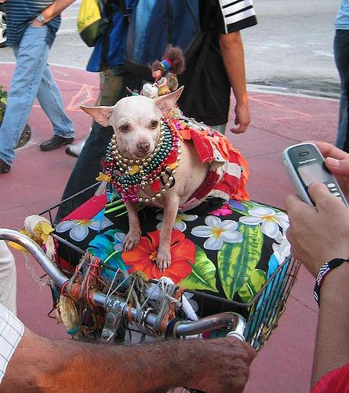

# Dataset Card for Stanford Dogs Dataset

## Dataset Description

- **Homepage**: http://vision.stanford.edu/aditya86/ImageNetDogs/
- **Repository**:
- **Paper**:

Primary: 

 Aditya Khosla, Nityananda Jayadevaprakash, Bangpeng Yao and Li Fei-Fei. Novel dataset for Fine-Grained Image Categorization. First Workshop on Fine-Grained Visual Categorization (FGVC), IEEE Conference on Computer Vision and Pattern Recognition (CVPR), 2011.  [[pdf]](https://people.csail.mit.edu/khosla/papers/fgvc2011.pdf) [[poster]](http://vision.stanford.edu/documents/KhoslaJayadevaprakashYaoFeiFei_FGVC2011.pdf) [[BibTex]](http://vision.stanford.edu/bibTex/KhoslaJayadevaprakashYaoFeiFei_FGVC2011.bib)

Secondary:

 J. Deng, W. Dong, R. Socher, L.-J. Li, K. Li and L. Fei-Fei, ImageNet: A Large-Scale Hierarchical Image Database. IEEE Computer Vision and Pattern Recognition (CVPR), 2009. 


- **Leaderboard**:
- **Point of contact**: aditya86@cs.stanford.edu, bangpeng@cs.stanford.edu

### Dataset Summary

The Stanford Dogs dataset contains images of 120 breeds of dogs from around the world. This dataset has been built using images and annotation from ImageNet for the task of fine-grained image categorization.

### Supported Tasks and Leaderboards

### Languages
American English

## Dataset Structure

### Data Instances

There are a total of 20,580 images; ~150 images per class. Moreover, there is an annotation for each instance (image).

This is an example of an annotation of an image of class chihuahua:

```
<annotation>
	<folder>02085620</folder>
	<filename>n02085620_7</filename>
	<source>
		<database>ImageNet database</database>
	</source>
	<size>
		<width>250</width>
		<height>188</height>
		<depth>3</depth>
	</size>
	<segment>0</segment>
	<object>
		<name>Chihuahua</name>
		<pose>Unspecified</pose>
		<truncated>0</truncated>
		<difficult>0</difficult>
		<bndbox>
			<xmin>71</xmin>
			<ymin>1</ymin>
			<xmax>192</xmax>
			<ymax>180</ymax>
		</bndbox>
	</object>
</annotation>
```

On the other hand, this is an example of an image of this same class:



### Data Fields

Images and annotations for each of the classes.

### Data Splits

## Dataset Creation

### Curation Rationale

### Source Data

#### Initial Data Collection and Normalization

#### Who are the source language producers?

### Annotations

#### Annotation process

#### Who are the annotators?

### Personal and Sensitive Information

## Considerations for Using the Data

### Social Impact of Dataset

### Discussion of Biases

### Other Known Limitations

## Additional Information

### Dataset Curators

- Aditya Khosla (aditya@pathai.com, 
khosla@csail.mit.edu) 
- Nityananda Jayadevaprakash     
- Bangpeng Yao     
- Li Fei-Fei (feifeili@cs.stanford.edu)

### Licensing Information

### Citation Information

Dataset card template: https://github.com/huggingface/datasets/blob/main/templates/README_guide.md

### Contributors