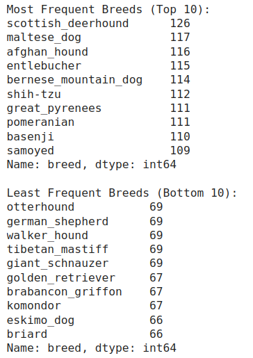

# Dataset Card for Stanford Dogs Dataset

## Dataset Description

- **Homepage**: http://vision.stanford.edu/aditya86/ImageNetDogs/
- **Repository**: https://www.kaggle.com/models/ameyjoshi0209/dog-breed-classification
- **Paper**: https://www.kaggle.com/models/google/mobilenet-v2

Primary: 

 Aditya Khosla, Nityananda Jayadevaprakash, Bangpeng Yao and Li Fei-Fei. Novel dataset for Fine-Grained Image Categorization. First Workshop on Fine-Grained Visual Categorization (FGVC), IEEE Conference on Computer Vision and Pattern Recognition (CVPR), 2011.  [[pdf]](https://people.csail.mit.edu/khosla/papers/fgvc2011.pdf) [[poster]](http://vision.stanford.edu/documents/KhoslaJayadevaprakashYaoFeiFei_FGVC2011.pdf) [[BibTex]](http://vision.stanford.edu/bibTex/KhoslaJayadevaprakashYaoFeiFei_FGVC2011.bib)

Secondary:

 J. Deng, W. Dong, R. Socher, L.-J. Li, K. Li and L. Fei-Fei, ImageNet: A Large-Scale Hierarchical Image Database. IEEE Computer Vision and Pattern Recognition (CVPR), 2009. 


- **Point of contact**: aditya86@cs.stanford.edu, bangpeng@cs.stanford.edu

### Dataset Summary

The Stanford Dogs dataset contains images of 120 breeds of dogs from around the world. This dataset has been built using images and annotation from ImageNet for the task of fine-grained image categorization.

### Supported Tasks and Leaderboards

This dataset can be used in various models which perform an image classification task. It is important to mention that it was found in Kaggle's [Playground Prediction Competition](https://www.kaggle.com/competitions/dog-breed-identification/overview), which was held from September 29th 2017 to February 28th 2018. 7,525 entrants, 1,405 participants, 1,280 teams and 8,708 submission are some of the most relevant details of this competition as well as the models used: ```mobilenet_v2``` from Google and ```resent_50``` from TensorFlow. 

### Languages
American English

## Dataset Structure

### Data Instances

There are a total of 20,580 images; ~150 images per class. Moreover, there is an label for each instance (image).

The list of breeds is as follows:

```
affenpinscher
afghan_hound
african_hunting_dog
airedale
american_staffordshire_terrier
appenzeller
australian_terrier
basenji
basset
beagle
bedlington_terrier
bernese_mountain_dog
black-and-tan_coonhound
blenheim_spaniel
bloodhound
bluetick
border_collie
border_terrier
borzoi
boston_bull
bouvier_des_flandres
boxer
brabancon_griffon
briard
brittany_spaniel
bull_mastiff
cairn
cardigan
chesapeake_bay_retriever
chihuahua
chow
clumber
cocker_spaniel
collie
curly-coated_retriever
dandie_dinmont
dhole
dingo
doberman
english_foxhound
english_setter
english_springer
entlebucher
eskimo_dog
flat-coated_retriever
french_bulldog
german_shepherd
german_short-haired_pointer
giant_schnauzer
golden_retriever
gordon_setter
great_dane
great_pyrenees
greater_swiss_mountain_dog
groenendael
ibizan_hound
irish_setter
irish_terrier
irish_water_spaniel
irish_wolfhound
italian_greyhound
japanese_spaniel
keeshond
kelpie
kerry_blue_terrier
komondor
kuvasz
labrador_retriever
lakeland_terrier
leonberg
lhasa
malamute
malinois
maltese_dog
mexican_hairless
miniature_pinscher
miniature_poodle
miniature_schnauzer
newfoundland
norfolk_terrier
norwegian_elkhound
norwich_terrier
old_english_sheepdog
otterhound
papillon
pekinese
pembroke
pomeranian
pug
redbone
rhodesian_ridgeback
rottweiler
saint_bernard
saluki
samoyed
schipperke
scotch_terrier
scottish_deerhound
sealyham_terrier
shetland_sheepdog
shih-tzu
siberian_husky
silky_terrier
soft-coated_wheaten_terrier
staffordshire_bullterrier
standard_poodle
standard_schnauzer
sussex_spaniel
tibetan_mastiff
tibetan_terrier
toy_poodle
toy_terrier
vizsla
walker_hound
weimaraner
welsh_springer_spaniel
west_highland_white_terrier
whippet
wire-haired_fox_terrier
yorkshire_terrier

```

All labels are stored in a separate csv, which has the attributes ```image_id``` and ```class```. As can be understood, each image is associated to an unique *image_id*.

For instance, this are some lines of such file:

|id|class|
|------|-----|
|000bec180eb18c7604dcecc8fe0dba07| boston_bull|
|001513dfcb2ffafc82cccf4d8bbaba97|dingo|
|001cdf01b096e06d78e9e5112d419397|pakinese|
|00214f311d5d2247d5dfe24b2303d|bluetick|
|0021f9ceb3235effd7fcde7f7538ed62|golden_retriever|


On the other hand, this is an example of an image that could be the one shown in the first entrance of the csv. It is an image of a *Boston Bull*:


Each image has a filename that is its unique ```id```. 

### Data Fields

Images and annotations for each of the classes.

### Data Splits

- ```train``` - the training set, where we are provided the breed for these dogs.
- ```test``` - the test set, we must predict the probability of each breed for each image.
- ```annotations``` - the breeds for the images in the train set.
- ```images``` - images of the dogs used in both sets.

## Dataset Creation

### Curation Rationale

The dataset was likely created to support accurate breed identification for animal welfare, research, educational purposes, commercial applications, and to improve breed-specific understanding in both scientific and public contexts.

### Source Data

The source data are images of different dog breeds in diverse contexts and situations, which allows for a wider representation of the animal.

#### Initial Data Collection and Normalization

#### Who are the source language producers?

This dataset has been built using images and annotation from ImageNet for the task of fine-grained image categorization.

[ImageNet](https://www.image-net.org/index.php) is an image database organized according to the [WordNet](https://wordnet.princeton.edu/) hierarchy (currently only the nouns), in which each node of the hierarchy is depicted by hundreds and thousands of images. The project, developed by Princeton, has been instrumental in advancing computer vision and deep learning research. More than 14 million images have been hand-annotated by the project to indicate what objects are pictured and in at least one million of the images, bounding boxes are also provided. The data is available for free to researchers for non-commercial use.


### Personal and Sensitive Information

Sensitive information is data that must be protected from unauthorized access to safeguard the privacy or security of an individual or organization. This information encompasses the types of data where exposure could lead to detrimental consequences for the welfare and security of individuals and organizations.

The dataset contains, indeed, identity categories. However, we cannot state that this identification falls under the concept of sensitive information as these categories do not refer to humans.

## Considerations for Using the Data

### Social Impact of Dataset

This dataset can help in accurately identifying dog breeds, which could assist shelters, vets, and animal control in quickly recognizing lost or stray dogs. Breed identification is also valuable for ensuring breed-specific health care and dietary recommendations.

By improving breed identification, it can support more accurate categorization of dogs for adoption, avoiding cases where a breed is misidentified, which can affect adoption chances. Moreover, the dataset can also be used in commercial applications like breed detection for pet-related services or in AR apps for dog enthusiasts.

On the other hand, if misused, it could reinforce breed stereotypes or be used in ways that unintentionally promote breed-specific biases. For instance, if an image misclassification leads to incorrect information on a dog’s behavior or temperament, it could negatively impact perceptions of certain breeds.

### Discussion of Biases

We see that dataset is quite unbalanced (see image below), so the model might perform better on frequently represented breeds, leading to biased results. Related with that and geographically speaking, it may favor dog breeds that are more common in certain regions. For example, breeds like Akita (breed from Japan) are not represented in the dataset as they are not found easily around the globe.



More technically, lighting, image quality, and background variations can introduce biases, as certain breeds may be photographed under different conditions (e.g., show dogs vs. everyday pets).

Lastly, if images were labeled by humans, personal biases could have influenced breed labels, particularly for mixed-breed dogs or dogs that don’t fit typical breed standards.


### Other Known Limitations

Many dogs are mixed-breed, which may not be accurately represented in a dataset focused on purebred classifications. This can lead to poor performance on mixed breeds or overconfidence in assigning a breed. Moreover, there can be significant variability within a single breed due to genetic and physical diversity, as well as differences due to signs of aging, health conditions or grooming.

## Additional Information

### Dataset Curators

- Aditya Khosla (aditya@pathai.com, 
khosla@csail.mit.edu) 
- Nityananda Jayadevaprakash     
- Bangpeng Yao     
- Li Fei-Fei (feifeili@cs.stanford.edu)

### Licensing Information

[Attribution 4.0 International (CC BY 4.0)](https://creativecommons.org/licenses/by/4.0/)

### Citation Information

Dataset card template: https://github.com/huggingface/datasets/blob/main/templates/README_guide.md

