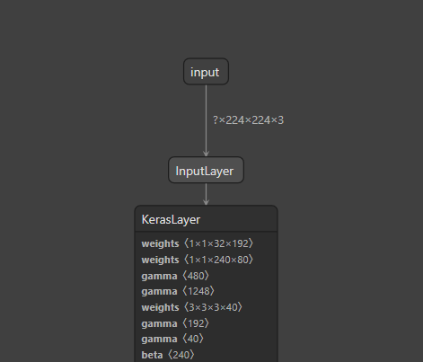
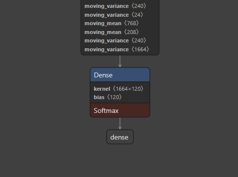

# Model card for mobilenet_v2

## Model Details

### Model description

- **Developed by**: Google, TensorFlow
- **Shared by**: Kaggle
- **Model type**: SSD-based object detection model
- **Language(s) (NLP)**:
- **License**: Apache 2.0
- **Finetuned from model (opt)**:


### Model Sources

The model is [publicly available](https://github.com/tensorflow/models/blob/master/research/object_detection/samples/configs/faster_rcnn_inception_resnet_v2_atrous_oid.config) as part of [TensorFlow Object Detection API](https://github.com/tensorflow/models/tree/master/research/object_detection). The MobileNet V2 feature extractor was trained on ImageNet and fine-tuned with SSD head on [Open Images V4 dataset](https://storage.googleapis.com/openimages/web/index.html), containing 600 classes.

- **Repository**: https://github.com/tensorflow/tfhub.dev/tree/master/assets/docs/google


## Uses

### Direct use

This is a [SavedModel in TensorFlow 2 format](https://www.tensorflow.org/hub/tf2_saved_model). Using it requires TensorFlow 2 (or 1.15) and TensorFlow Hub 0.5.0 or newer.

This model can be used with the ```hub.KerasLayer``` as follows. It *cannot* be used with the ```hub.Module``` API for TensorFlow 1.

```
import tensorflow_hub as hub
m = tf.keras.Sequential([
    hub.KerasLayer("https://www.kaggle.com/models/google/mobilenet-v2/TensorFlow2/130-224-feature-vector/2",
                   trainable=False),  # Can be True, see below.
    tf.keras.layers.Dense(num_classes, activation='softmax')
])
m.build([None, 224, 224, 3])  # Batch input shape.

```
#### Inputs

The input ```images``` are expected to have color values in the range [0,1], following the [common image](https://www.tensorflow.org/hub/common_signatures/images#input) input conventions. For this model, the size of the input images is fixed to ```height``` x ```width``` = 224 x 224 pixels.



#### Outputs

The output is a dictionary containing:

- **detection_boxes**: A `tf.float32` tensor of shape `[N, 4]`, providing bounding box coordinates in the format `[ymin, xmin, ymax, xmax]`.
- **detection_class_entities**: A `tf.string` tensor of shape `[N]`, listing detection class names as Freebase MIDs.
- **detection_class_names**: A `tf.string` tensor of shape `[N]`, offering human-readable detection class names.
- **detection_class_labels**: A `tf.int64` tensor of shape `[N]`, containing class indices.
- **detection_scores**: A `tf.float32` tensor of shape `[N]`, reflecting detection scores.

For our specific task of dog breed classification, the model has been adapted to output a 1x120 tensor instead of bounding boxes. This tensor represents a softmax distribution over the 120 dog breeds in our dataset, providing probability scores for each class and indicating the likelihood that the image belongs to each breed. This output is achieved by adding a fully connected Deep Neural Network (DNN) layer on top of the base MobileNetV2 model, mapping the feature embeddings into a 120-dimensional output. The softmax activation function ensures that these values sum to 1, enabling a probabilistic interpretation of the model’s predictions.




#### Out-of-Scope Use

The model is not intended for the following applications:

- **Medical Diagnosis**: The model should not be used for any medical purposes, including diagnosing conditions related to dog breeds or health issues.
- **Legal or Security Decisions**: Outputs should not be used to inform legal judgments or security-related decisions, including breed discrimination or identification.
- **Surveillance**: The model is not designed for surveillance or monitoring purposes, especially in sensitive environments or without consent.
- **Animal Welfare Decisions**: The model should not be used to determine the welfare or treatment of animals based on breed classifications.
- **Unverified Environments**: The model should not be deployed in unverified or uncontrolled environments where accuracy cannot be guaranteed.

Users are encouraged to apply the model within its intended context and adhere to ethical guidelines to prevent misuse.

## Bias, Risks and Limitations

Image classification models are powerful tools, but they come with inherent challenges that can affect their performance and ethical use. This section outlines key aspects of bias, risks, and limitations associated with these models.

### Bias in Training Data

Bias in image classification models often stems from the training data used to develop them. If the dataset is not representative of the diverse range of inputs the model will encounter in real-world applications, the model may learn skewed or inaccurate patterns. Key factors include:

- **Underrepresentation**: In our case, most of the dog breeds or characteristics are not underrepresented in the training data. Although there is class imbalance that could be treated with data augmentation techniques.
- **Societal Bias**: Models may inadvertently reflect societal biases present in the training data, potentially perpetuating stereotypes or inaccuracies in breed classification.

To mitigate bias, it’s crucial to curate diverse and high-quality datasets that accurately represent the populations and scenarios the model will encounter.

### Risks of Misclassification

While image classification models can achieve high accuracy, they carry risks related to misclassification. This can have real-world implications, particularly in sensitive applications. Key considerations include:

- **Generalization**: Models may struggle to generalize to new or unseen data, especially if it differs significantly from the training set. This can lead to decreased accuracy and reliability in practical use. 
- **Interpretability**: Users may find it challenging to understand why the model arrived at a particular classification, complicating trust and accountability.

Addressing these risks requires ongoing evaluation, robust testing on diverse datasets, and improved interpretability methods.

### Limitations in Application

Beyond bias and misclassification, image classification models have inherent limitations that can affect their usability:

- **Context Dependence**: The model's effectiveness can vary significantly based on context. Environmental factors, such as lighting and background, can influence performance, leading to inconsistent results.
- **Static Learning**: Once trained, models may not adapt to new information or evolving datasets without retraining, limiting their flexibility in dynamic environments.
- **Ethical Implications**: The use of classification models in certain contexts, such as breed identification for discrimination or profiling, raises ethical concerns. Users must be aware of potential misuse and consider the implications of deploying such models.

To effectively use image classification models, it is essential to understand these limitations and consider them in the context of deployment to ensure responsible and ethical application.

### Recommendations

To address these issues, it is crucial to use high-quality training data, employ bias reduction techniques, and conduct thorough evaluations of model fairness. Additionally, fostering transparency and collaboration among different disciplines is essential.


## How to Get Started with the Model

Getting started with the model is straightforward. Follow the steps below to create and compile your image classification model using TensorFlow and a pre-trained backbone from TensorFlow Hub.

### Step 1: Define Model Parameters

First, you will need to specify the parameters for your model, including the input shape, output shape, model URL, optimizer, and evaluation metrics. For example:

```python
input_shape = [None, 224, 224, 3]  # Adjust according to your input requirements
output_shape = 120  # Number of dog breeds
model_url = "URL_OF_THE_PRE_TRAINED_MODEL"  # Replace with actual model URL
optimizer = "adam"  # Choose your optimizer
metrics = ["accuracy"]  # Define metrics for evaluation
```

### Step 2: Create and Compile the Model

Use the `create_model()` function in `mates/features/features.py` to create and compile your model:

```python
model = create_model(input_shape, output_shape, model_url, optimizer, metrics)
```

This function performs the following tasks:
- Loads a pre-trained model from TensorFlow Hub.
- Adds a dense layer with softmax activation for multi-class classification.
- Compiles the model with the specified loss function, optimizer, and metrics.

### Step 3: Build the Model

The model is automatically built when you call the `create_model` function, but if you need to build it manually, you can use:

```python
model.build(input_shape)
```

### Step 4: Train the Model

After the model is created and compiled, you can proceed to train it with your dataset using the `fit` method:

```python
# Example of training the model
model.fit(train_data, epochs=10, validation_data=val_data)
```

### Step 5: Evaluate the Model

Once training is complete, evaluate the model on test data to assess its performance:

```python
model.evaluate(test_data)
```

By following these steps, you can effectively get started with the model and tailor it to your specific dog breed classification tasks.

## Training Details

The MobileNet V2 feature extractor was trained on [Open Images V4](https://storage.googleapis.com/openimages/web/index.html).

The checkpoint exported into this model was ```mobilenet_v2_1.3_224/mobilenet_v2_1.3_224.ckpt``` downloaded from [MobileNet V2 pre-trained models](https://github.com/tensorflow/models/blob/master/research/slim/nets/mobilenet/README.md). Its weights were originally obtained by training on the ILSVRC-2012-CLS dataset for image classification ("Imagenet").


### Training Data

More specifically, this model card has been completed by extracting results from running the model with the data from [Stanford Dogs Dataset](http://vision.stanford.edu/aditya86/ImageNetDogs/).

The training set from this data contains the 49.67% of the total data, which are approximately 10223 images.

### Training Procedure


#### Training Hyperparameters

Different batch configurations have been built as well as various optimization functions. 
The two batches are ones using a 32 batch and a 64 batch and the optimizers considered are *Rmsprop*, *Adam*, *AdamW* and *SGD*.

The chosen combination of batch and optimizer is **Batch 32 using AdamW**, as it is the one with best accuracy.

Moreover, the model has a total of 3965848 parameters, with only 199800 of them being trainable.


## Evaluation

### Testing Data, Factors & Metrics

#### Testing Data

The data set corresponding to test contains 50.33% of the total images. This means that approximately 10358 images have been used for this part.

#### Factors

The factors taken into account for the model evaluation are *Accuracy* and *Loss*.

#### Metrics

The metrics considered when evaluating the model can be divided into two main categories. The first one refers to model performance while the second is used to environmental. These last will be addressed in the section below.

The performance metrics considered are *Train accuracy*, *Train validation accuracy*, *Train validation loss* and *Train loss*.

### Results

Firstly, between the Batch 32 and Batch 64 configurations, we see that, overall, Batch 32 configurations show better results. Because of this, we will do a further comparison just between them.

The Batch 32 AdamW configuration appears to strike an optimal balance between accuracy and
emissions, making it a strong candidate for deployment. Even though it does not have the best numbers when it comes to RAM power, the difference is so low that can be almost ignored. Given the low emissions and energy metrics, this configuration is environmentally sustainable, allowing for their use in scenarios where energy efficiency is paramount.

#### Summary

The table below, summarizes all the performance metrics considered when evaluating the model. As said above, considering only the different configurations of Batch 32.

| Metric | Rmsprop | AdamW | SGD | Adam |
| ------ | ----- | ----- | ----- | ----- |
|Duration (min) | 9.7 | 9.7| 10.2 | 13.7 |
|Train validation accuracy | 0.8194 | 0.8230| 0.7982 | 0.8236 |
|Train accuracy | 0.9713| 0.9943| 0.8485 | 0.9993 |
|Train validation loss | 0.5966 | 0.5694| 0.8626 | 0.5682 |
|Train loss | 0.1097 | 0.0732| 0.7642 | 0.0414 |


## Environmental Impact

The next table shows the results of the environmental metrics avaluated. Again, the focus is on Batch 32.

| Metric            | Rmsprop  | AdamW    | SGD     | Adam    |
|-------------------|----------|----------|---------|---------|
| Emissions (kg)     | 0.000391 | 0.000390 | 0.000412| 0.000560|
| Emissions Rate     | 7.07 × 10⁻⁷ | 7.07 × 10⁻⁷ | 7.07 × 10⁻⁷ | 7.07 × 10⁻⁷ |
| CPU Power (W)      | 14       | 14       | 14      | 14      |
| RAM Power (W)      | 0.6395   | 0.6519   | 0.6487  | 0.6556  |
| Energy Consumed (kWh) | 0.00225 | 0.00224 | 0.00237 | 0.00322 |

Carbon emissions can be estimated using the [Machine Learning Impact calculator](https://mlco2.github.io/impact/#compute) presented in [Lacoste et al. (2019)](https://arxiv.org/abs/1910.09700).

- **Hardware Type**:

CPU count = 8

CPU Model: 11th Gen Intel(R) Core(TM) i5-1155G7 @ 2.50GHz

- **Hours used**: Looking at the table shown in the evaluation summary, we estimate that the Batch 32 used 43.3 minutes. Adding the 38.2 minutes used by the Batch 64 we get that the total used hours are **less than 1.5h**
- **Cloud Provider**: NaN
- **Compute Region**: NaN
- **Carbon Emitted**: 0.390g


## Citation


Kaggle link of the model: https://www.kaggle.com/models/google/mobilenet-v2

Model card template: https://github.com/huggingface/huggingface_hub/blob/main/src/huggingface_hub/templates/modelcard_template.md


## Model Card Contact

Noa Mediavilla - noa.mediavilla@estudiantat.upc.edu

Matilde Simões - matilde.simoes@estudiantat.upc.edu

Andrea Tomás - andrea.tomas@estudiantat.upc.edu

Maria Tubella - maria.tubella@estudiantat.upc.edu

Juan Pablo Zaldívar - juan.pablo.zaldivar@estudiantat.upc.edu

